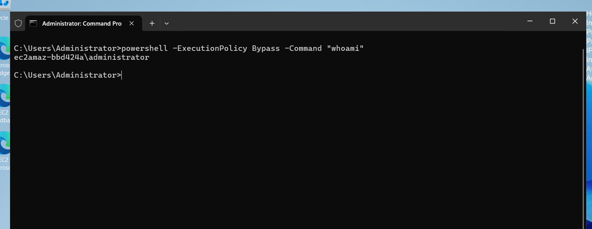
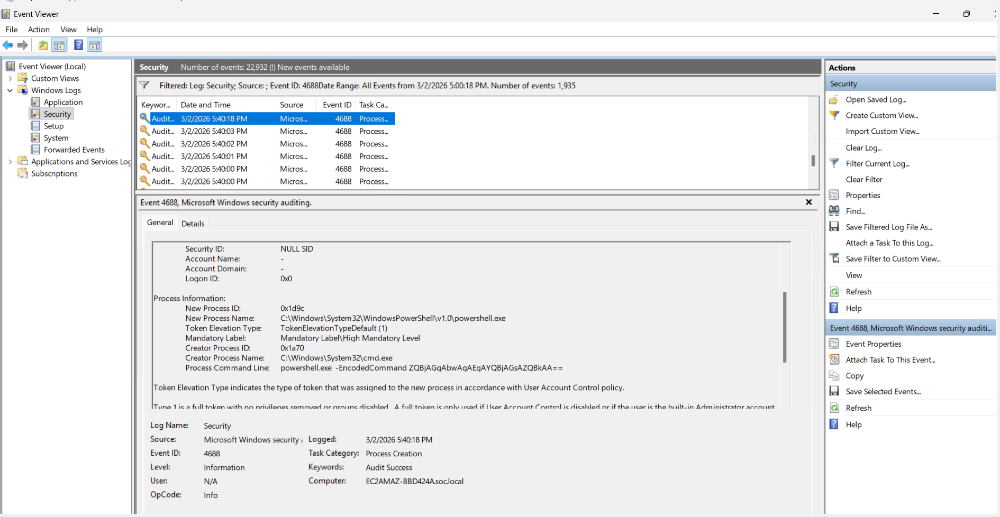
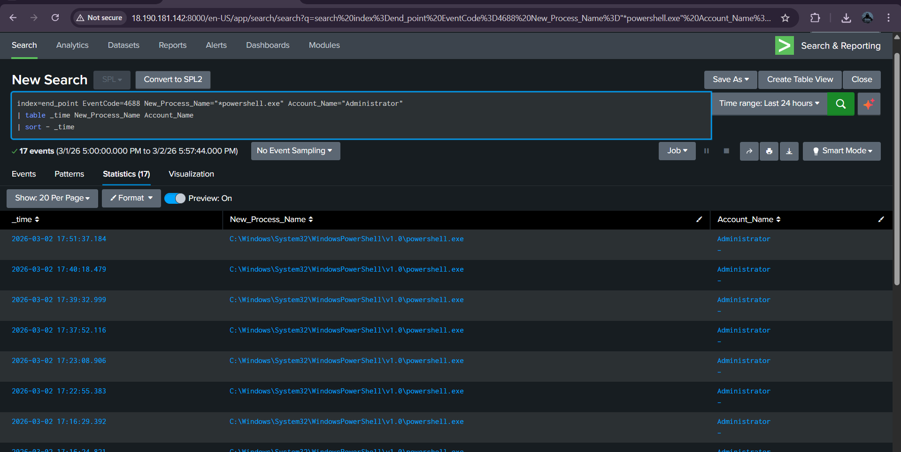

# ENDPOINT-02 — Suspicious PowerShell Encoded Command Detection (Event ID 4688)

   

---

## 📋 Executive Summary

A suspicious PowerShell execution was simulated using an **encoded command**, a common attacker technique for **obfuscation and defense evasion**.

This triggered **Event ID 4688 (Process Creation)** in Windows logs. Splunk SIEM successfully detected the activity by identifying the presence of `-EncodedCommand` in the command line.

---

## 🧩 Lab Environment

| Component | Details |
|---|---|
| Target System | Windows Endpoint |
| Attacker Machine | Analyst Laptop |
| Log Source | Windows Security Logs |
| Event ID | 4688 |
| SIEM | Splunk (`index=end_point`) |
| Attack Type | Obfuscated Command Execution |

---

## 🧠 What is Event ID 4688?

Event ID **4688** is generated when a new process is created.

It includes:
- Process name  
- Parent process  
- Command line arguments  
- User context  

---

## 🔴 Attack Simulation

### Step 1 — Enable Process Creation Auditing

```cmd
auditpol /set /subcategory:"Process Creation" /success:enable
```

Verify:

```cmd
auditpol /get /subcategory:"Process Creation"
```

Expected:
```
Process Creation Success
```

---

### Step 2 — Enable Command Line Logging (Important)

Open:
```
Win + R → gpedit.msc
```

Navigate:
```
Computer Configuration
→ Administrative Templates
→ System
→ Audit Process Creation
```

Enable:
```
Include command line in process creation events
```

Apply changes and reboot system.

---

### Step 3 — Update Policy

```cmd
gpupdate /force
```

---

### Step 4 — Execute Encoded PowerShell

```cmd
powershell.exe -EncodedCommand ZQBjAGgAbwAgAEgAYQBjAGsAZQBkAA==
```

Output:
```
Hacked
```

<p align="center">
  
</p>

---

## 🔍 Event Viewer Verification

Open:

```cmd
eventvwr.msc
```

Navigate:

```
Windows Logs → Security
```

Filter:

```
Event ID = 4688
```

Look for:
- New Process Name: powershell.exe  
- Command Line includes `-EncodedCommand`  

<p align="center">
  
</p>

---

## 🔍 Splunk Detection

```spl
index=end_point EventCode=4688 "EncodedCommand"
| table _time New_Process_Name CommandLine Account_Name
| sort - _time
```

<p align="center">
  
</p>

---

## 🧠 SOC Investigation Summary

- Suspicious process: powershell.exe  
- Parent process: cmd.exe  
- Encoded command used (obfuscation)  
- Executed with elevated privileges  

---

## 🔓 Payload Analysis

Encoded string:
```
ZQBjAGgAbwAgAEgAYQBjAGsAZQBkAA==
```

Decoded:
```
echo Hacked
```

⚠ In real-world scenarios, this may include:
- Reverse shell payload  
- Credential dumping scripts  
- Malware loaders  

---

## 🕒 Timeline

| Time | Activity | Event ID |
|------|----------|----------|
| T1 | cmd.exe executed | 4688 |
| T2 | powershell.exe launched | 4688 |
| T3 | Encoded command executed | 4688 |
| T4 | SIEM alert triggered | Correlated |

---

## ⚠️ Risk Assessment

**Severity: HIGH**

Reasons:
- Obfuscated command execution  
- Elevated privileges  
- Suspicious parent-child process chain  
- Common attacker technique  

---

## 🛡 MITRE ATT&CK Mapping

- T1059.001 — PowerShell  
- T1027 — Obfuscated/Encoded Command  
- T1059 — Command Execution  

---

## 🛠 Recommended SOC Response

- Enable Script Block Logging (Event ID 4104)  
- Alert on `EncodedCommand` usage  
- Restrict PowerShell execution policy  
- Investigate parent process chain  
- Check other endpoints for similar behavior  
- Deploy EDR monitoring  

---

## 🎯 Conclusion

The encoded PowerShell execution was successfully detected using Windows logs and Splunk SIEM. This behavior closely resembles real-world attack techniques used in **post-exploitation and ransomware deployment**.

---
