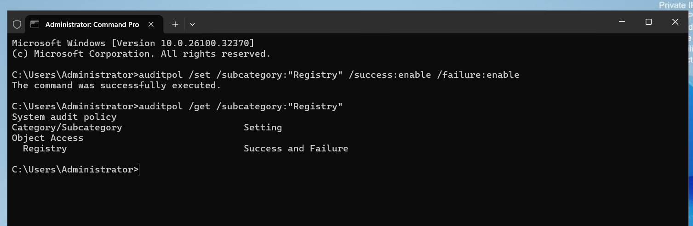
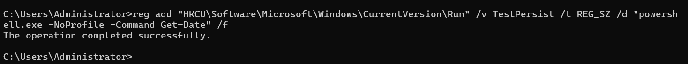
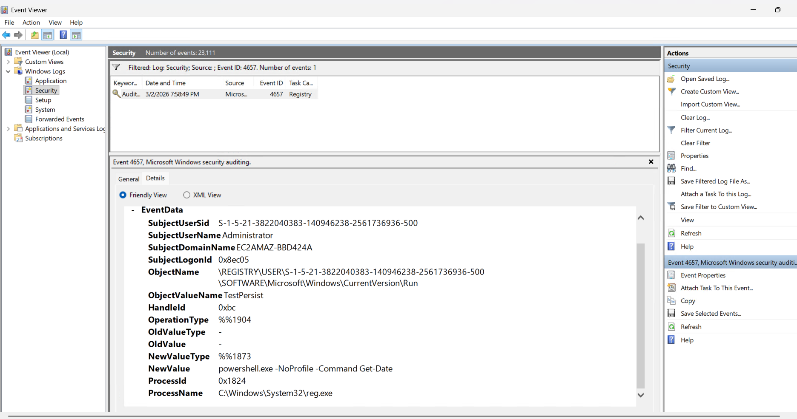
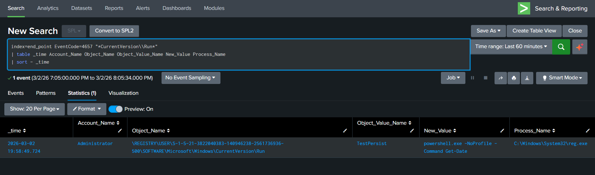

# ENDPOINT-03 — Registry Persistence Detection (Event ID 4657)

   

---

## 📋 Executive Summary

A persistence attack was simulated by adding a malicious entry to the **Windows Registry Run key**, allowing execution at user logon.

This triggered **Event ID 4657 (Registry Value Modification)** in Windows Security logs. Splunk SIEM successfully detected the persistence mechanism by identifying changes in the Run key.

---

## 🧩 Lab Environment

| Component | Details |
|---|---|
| Target System | Windows Endpoint |
| Attacker Machine | Analyst Laptop |
| Log Source | Windows Security Logs |
| Event ID | 4657 |
| SIEM | Splunk (`index=end_point`) |
| Attack Type | Persistence |

---

## 🧠 What is Event ID 4657?

Event ID **4657** is generated when a registry value is modified.

It includes:
- Registry path  
- Value name  
- New value  
- Process responsible  

---

## 🔴 Attack Simulation

### Step 1 — Enable Registry Auditing

```cmd
auditpol /set /subcategory:"Registry" /success:enable /failure:enable
```

Verify:

```cmd
auditpol /get /subcategory:"Registry"
```

Expected:
```
Registry Success and Failure
```

<p align="center">
  
</p>

---

### Step 2 — Enable Auditing on Run Key

Open:
```
Win + R → regedit
```

Navigate:
```
HKEY_CURRENT_USER
→ Software
→ Microsoft
→ Windows
→ CurrentVersion
→ Run
```

Go to:
```
Permissions → Advanced → Auditing
```

Add:
```
Principal: Everyone
Permissions:
✔ Set Value
✔ Create Subkey
✔ Delete
```

---

### Step 3 — Add Persistence

```cmd
reg add "HKCU\Software\Microsoft\Windows\CurrentVersion\Run" /v TestPersist /t REG_SZ /d "powershell.exe -NoProfile -Command Get-Date" /f
```

Expected:
```
The operation completed successfully.
```

<p align="center">
  
</p>

---

## 🔍 Event Viewer Verification

Open:

```cmd
eventvwr.msc
```

Navigate:

```
Windows Logs → Security
```

Filter:

```
Event ID = 4657
```

Look for:
- Object Name: `...\CurrentVersion\Run`  
- Value Name: TestPersist  
- New Value: PowerShell command  

<p align="center">
  
</p>

---

## 🔍 Splunk Detection

```spl
index=end_point EventCode=4657 "*CurrentVersion\\Run*"
| table _time Account_Name Object_Name Object_Value_Name New_Value Process_Name
| sort - _time
```

<p align="center">
  
</p>

---

## 🧠 SOC Investigation Summary

- Registry Run key modified  
- Persistence established at logon  
- PowerShell command configured  
- Action executed via reg.exe  
- Performed under Administrator privileges  

---

## 🕒 Timeline

| Time | Activity | Event ID |
|------|----------|----------|
| T1 | Registry auditing enabled | Policy |
| T2 | Run key modified | 4657 |
| T3 | SIEM alert triggered | Correlated |

---

## ⚠️ Risk Assessment

**Severity: HIGH**

Reasons:
- Startup persistence mechanism  
- Registry Run key abuse  
- PowerShell execution at login  
- Administrative privileges used  

---

## 🛡 MITRE ATT&CK Mapping

- T1547.001 — Registry Run Keys / Startup Folder  
- TA0003 — Persistence  

---

## 🛠 Recommended SOC Response

- Remove malicious registry entry  
- Check other persistence locations  
- Investigate PowerShell activity  
- Review Event ID 4688 logs  
- Search environment for similar modifications  
- Perform full endpoint scan  

---

## 🧹 Cleanup

```cmd
reg delete "HKCU\Software\Microsoft\Windows\CurrentVersion\Run" /v TestPersist /f
```

---

## 🎯 Conclusion

The registry persistence attack was successfully simulated and detected using Windows Security Logs and Splunk SIEM. This technique closely mirrors real-world attacker behavior used to maintain long-term access.

---
