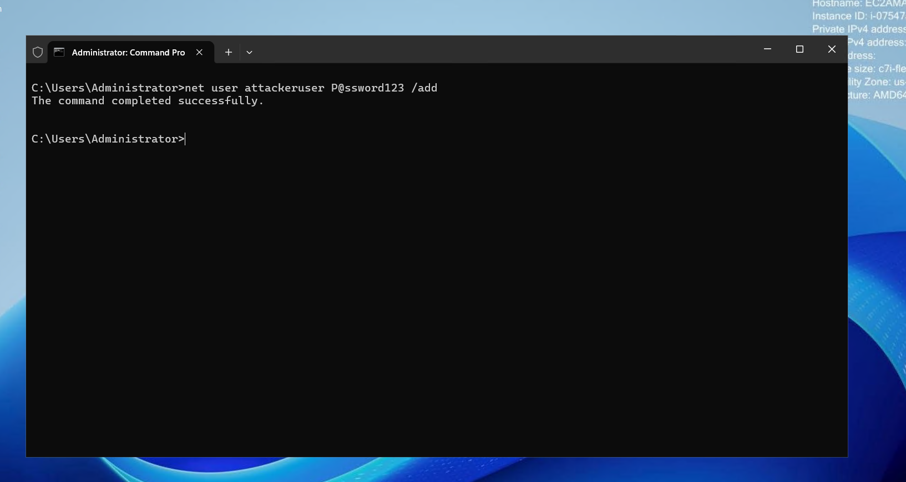
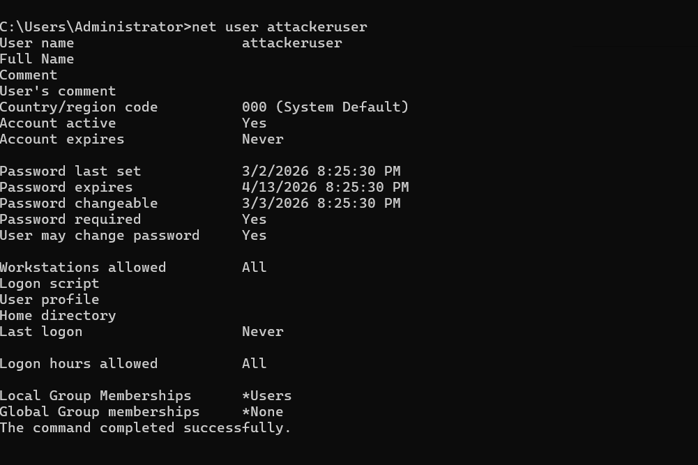
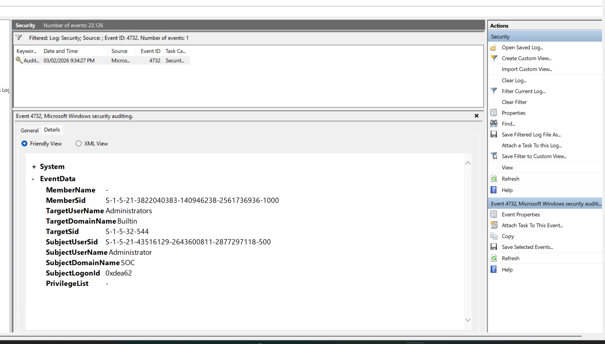
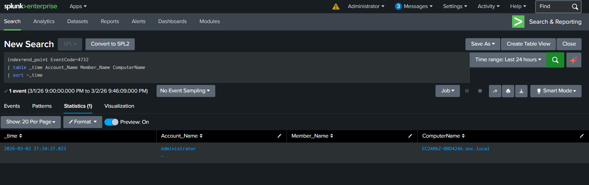

# ENDPOINT-04 — Privilege Escalation Detection (Event ID 4720 & 4732)

   

---

## 📋 Executive Summary

A **Privilege Escalation attack** was simulated by creating a new local user (`attackeruser`) and adding it to the **Administrators group**. This generated **Event ID 4720 (User Creation)** and **Event ID 4732 (Group Membership Change)** in Windows Security logs.

Splunk SIEM successfully detected the suspicious activity by correlating account creation and immediate privilege escalation.

---

## 🧩 Lab Environment

| Component | Details |
|---|---|
| Target System | Windows Endpoint |
| Attacker Machine | Analyst Laptop |
| Log Source | Windows Security Logs |
| Event IDs | 4720, 4732 |
| SIEM | Splunk (`index=end_point`) |
| Attack Type | Privilege Escalation |

---

## 🧠 What are Event IDs 4720 & 4732?

- **4720** → A new user account is created  
- **4732** → A user is added to a security-enabled local group  

These logs help detect **unauthorized privilege escalation**.

---

## 🔴 Attack Simulation

### Step 1 — Enable Security Group Auditing

```cmd
auditpol /get /subcategory:"Security Group Management"
```

If disabled, enable it:

```cmd
auditpol /set /subcategory:"Security Group Management" /success:enable /failure:enable
```

Verify:

```cmd
auditpol /get /subcategory:"Security Group Management"
```

<p align="center">
  
</p>

---

### Step 2 — Create Suspicious User

```cmd
net user attackeruser P@ssword123 /add
```

Expected:
```
The command completed successfully.
```

---

### Step 3 — Privilege Escalation

```cmd
net localgroup administrators attackeruser /add
```

Expected:
```
The command completed successfully.
```

<p align="center">
  
</p>

---

## 🔍 Event Viewer Verification

Open:

```cmd
eventvwr.msc
```

Navigate:

```
Windows Logs → Security
```

Filter:

```
Event ID = 4720, 4732
```

Verify inside Event 4732:
- Member Name: attackeruser  
- Group Name: Administrators  
- SubjectUserName: Administrator  

<p align="center">
  
</p>

---

## 🔍 Splunk Detection

```spl
index=end_point (EventCode=4720 OR EventCode=4732)
| table _time Computer Account_Name Member_Name Group_Name
| sort - _time
```

<p align="center">
  
</p>

---

## 🧠 SOC Investigation Summary

- Suspicious account: attackeruser  
- Account created and escalated within minutes  
- Added to Administrators group  
- Action performed using Administrator privileges  

---

## 🕒 Timeline

| Time | Activity | Event ID |
|------|----------|----------|
| T1 | User created | 4720 |
| T2 | Added to Administrators | 4732 |
| T3 | SIEM Alert | Correlated |

---

## ⚠️ Risk Assessment

**Severity: CRITICAL**

Reasons:
- Unauthorized admin access  
- Persistence mechanism  
- Potential lateral movement  
- Full system compromise risk  

---

## 🛡 MITRE ATT&CK Mapping

- T1098 — Account Manipulation  
- TA0004 — Privilege Escalation  
- TA0003 — Persistence  

---

## 🛠 Recommended SOC Response

- Disable suspicious account  
- Reset admin credentials  
- Verify authorization  
- Check login logs (Event ID 4624)  
- Investigate lateral movement  
- Perform endpoint forensic analysis  

---

## 🧹 Cleanup

```cmd
net user attackeruser /delete
```

---

## 🎯 Conclusion

The privilege escalation attack was successfully simulated and detected using Windows Security Logs and Splunk SIEM. This mirrors real-world attacker behavior involving **account manipulation and admin privilege abuse**.

---
