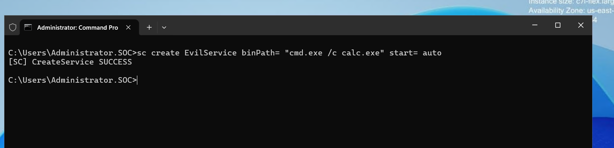
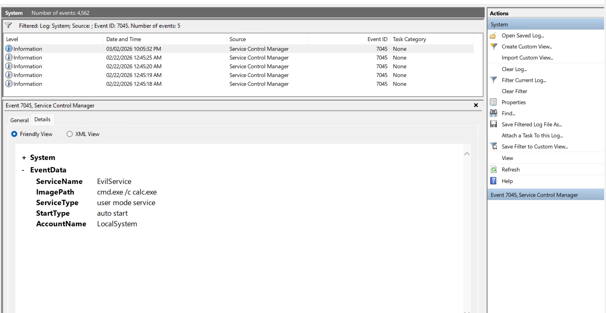
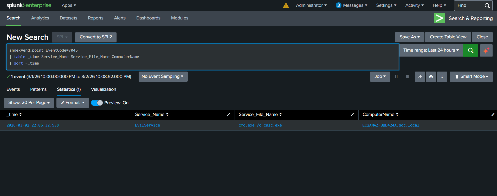

# ENDPOINT-05 — Suspicious Service Creation Detection (Event ID 7045)

   

---

## 📋 Executive Summary

A malicious Windows service was created to simulate **service-based persistence and SYSTEM-level execution**.

This triggered **Event ID 7045 (Service Installation)** in Windows System logs. Splunk SIEM successfully detected the activity by identifying the creation of a suspicious service with an unusual execution path.

---

## 🧩 Lab Environment

| Component | Details |
|---|---|
| Target System | Windows Endpoint |
| Attacker Machine | Analyst Laptop |
| Log Source | Windows System Logs |
| Event ID | 7045 |
| SIEM | Splunk (`index=end_point`) |
| Attack Type | Persistence / Privilege Escalation |

---

## 🧠 What is Event ID 7045?

Event ID **7045** is generated when a new service is installed in Windows.

It includes:
- Service name  
- Service file path  
- Start type  
- Account context  

---

## 🔴 Attack Simulation

### Step 1 — Create Suspicious Service

```cmd
sc create EvilService binPath= "cmd.exe /c calc.exe" start= auto
```

Expected:
```
[SC] CreateService SUCCESS
```

<p align="center">
  
</p>

---

## 🔍 Event Viewer Verification

Open:

```cmd
eventvwr.msc
```

Navigate:

```
Windows Logs → System
```

Filter:

```
Event ID = 7045
```

Verify:
- Service Name: EvilService  
- ImagePath: cmd.exe /c calc.exe  
- Start Type: Auto  
- Account Name: LocalSystem  

<p align="center">
  
</p>

---

## 🔍 Splunk Detection

```spl
index=end_point EventCode=7045
| table _time Service_Name Service_File_Name ComputerName
| sort - _time
```

<p align="center">
  
</p>

---

## 🧠 SOC Investigation Summary

- Suspicious service: EvilService  
- Auto-start enabled  
- Executed via cmd.exe  
- Running under SYSTEM privileges  
- No legitimate business purpose  

---

## 🕒 Timeline

| Time | Activity | Event ID |
|------|----------|----------|
| T1 | sc.exe executed | 4688 |
| T2 | Service installed | 7045 |
| T3 | SIEM alert triggered | Correlated |

---

## 🔗 Attack Chain (Correlation)

| Activity | Event ID |
|----------|----------|
| Privilege Escalation | 4732 |
| Malicious Process Execution | 4688 |
| Service Creation | 7045 |

This shows:
**Privilege Escalation → Persistence → SYSTEM Execution**

---

## ⚠️ Risk Assessment

**Severity: CRITICAL**

Reasons:
- SYSTEM-level execution  
- Auto-start persistence  
- Suspicious binary path  
- Potential full host compromise  

---

## 🛡 MITRE ATT&CK Mapping

- T1543.003 — Windows Service Creation  
- TA0003 — Persistence  
- TA0004 — Privilege Escalation  

---

## 🛠 Recommended SOC Response

- Disable and delete the service  
- Validate service creation authorization  
- Reset privileged credentials  
- Investigate related Event ID 4688 activity  
- Check for additional malicious services  
- Perform full endpoint scan  
- Monitor for re-creation of persistence  

---

## 🧹 Cleanup

```cmd
sc delete EvilService
```

Verify:

```cmd
sc query EvilService
```

---

## 🎯 Conclusion

The service creation attack was successfully simulated and detected using Windows logs and Splunk SIEM. This technique reflects real-world attacker behavior used to maintain persistence and execute payloads with elevated privileges.

---
