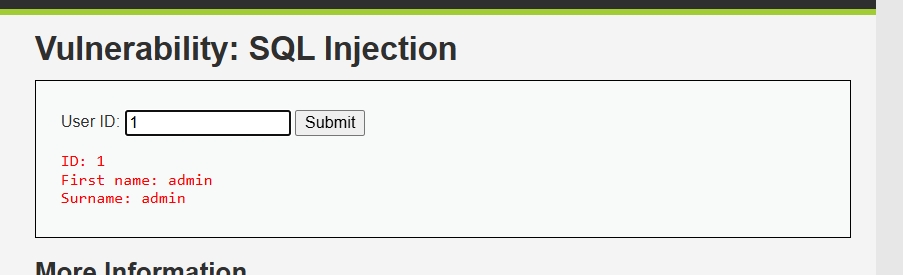
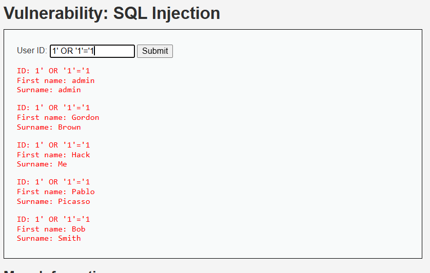
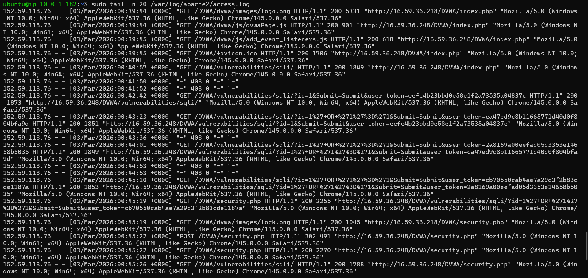

# WEB-01 — SQL Injection Attack Detection via DVWA

   

---

## 📋 Executive Summary

A SQL Injection attack was simulated against a DVWA (Damn Vulnerable Web Application) running on an Ubuntu EC2 web server. The payload `1' OR '1'='1` was injected into the User ID field, forcing the database to return all user records. Apache access logs captured the encoded attack payload, which was forwarded to Splunk SIEM. Splunk successfully detected the attack, identified the attacker IP, and confirmed data exposure via HTTP responses.

---

## 🧩 Lab Environment

| Component | Details |
|---|---|
| Attacker Machine | Analyst Laptop |
| Target Server | Ubuntu EC2 — Apache2 + DVWA |
| Target URL | `http://<public-ip>/DVWA/vulnerabilities/sqli/` |
| SIEM | Splunk (`index = web_logs`) |
| Log Source | `/var/log/apache2/access.log` |
| DVWA Security Level | Low |

---

## 🔴 Attack — SQL Injection

### Step 1 — Open DVWA

Navigate to `http://<public-ip>/DVWA` → Login → Set DVWA Security to **Low** → Go to **SQL Injection** module.
>
> *(Should show: DVWA SQL Injection page with "User ID" input box)*

```
<p align="center">
  
</p>
```

---

### Step 2 — Inject the Payload

Enter this in the **User ID** field and click **Submit**:

```sql
1' OR '1'='1
```

**Why this works:**

The app normally runs this query:
```sql
SELECT * FROM users WHERE id = '$id';
```

After injection it becomes:
```sql
SELECT * FROM users WHERE id = '1' OR '1'='1';
```

Since `'1'='1'` is always **TRUE**, the database ignores the WHERE condition and returns **every user**.

---

### Step 3 — View Attack Result

The page returns all 5 users from the database:

| First Name | Surname |
|---|---|
| admin | admin |
| Gordon | Brown |
| Hack | Me |
| Pablo | Picasso |
| Bob | Smith |
>
```
<p align="center">
  
</p>
```

---

## 📄 Attack Confirmation in Apache Logs

After the attack, run on the Ubuntu server:

```bash
sudo tail -n 20 /var/log/apache2/access.log
```

You will see the encoded payload in the log:

```
GET /DVWA/vulnerabilities/sqli/?id=1%27+OR+%271%27%3D%271&Submit=Submit HTTP/1.1" 200
```

**What the encoding means:**

| Encoded | Actual Character |
|---|---|
| `%27` | `'` (single quote) |
| `%3D` | `=` (equals sign) |
| `+` | ` ` (space) |

So `1%27+OR+%271%27%3D%271` = `1' OR '1'='1` — the attack payload is clearly visible in the log.
```
<p align="center">
  
</p>
```

---

## 🔍 Splunk Detection

Go to **Splunk → Search & Reporting** and run the queries below.

---

### Query 1 — Find All SQL Injection Attempts

```spl
index=web_logs
| search "%27"
```

This searches for all requests containing `%27` (encoded single quote) — the signature of SQL Injection in Apache logs.
```
<p align="center">
  
</p>
```

---

### Query 2 — Identify Attacker IP

```spl
index=web_logs
| search "%27"
| stats count by clientip
| sort -count
```

**Result:**

| clientip | count |
|---|---|
| 152.59.118.76 | 12 |

→ Attacker IP: **`152.59.118.76`**

---

### Query 3 — Check HTTP Status Codes

```spl
index=web_logs
| search "%27"
| stats count by status
```

**Result:**

| Status | What It Means |
|---|---|
| `200` | Attack request was processed — data returned |
| `500` | SQL error triggered — backend crashed on bad payload |

→ HTTP 500 confirms the injection caused a backend SQL error.

---

### Query 4 — Attack Timeline

```spl
index=web_logs
| search "%27"
| stats count min(_time) as firstSeen max(_time) as lastSeen by clientip
| convert ctime(firstSeen) ctime(lastSeen)
```

→ Shows when the attack started, ended, and how many requests were made.

---

## 🧠 SOC Investigation Summary

### Investigation Findings

| Question | Answer |
|---|---|
| Who is the attacker? | `152.59.118.76` (External IP) |
| What was targeted? | `/DVWA/vulnerabilities/sqli/` |
| What payload was used? | `1' OR '1'='1` |
| Was the attack successful? | ✅ Yes — all 5 user records returned |
| How many attempts? | 12 requests |
| Were there errors? | ✅ HTTP 500 — SQL errors triggered |
| Is IP internal or external? | External |

---

### ⚠️ Risk Assessment

| Field | Value |
|---|---|
| **Severity** | 🔴 HIGH |
| **Impact** | Full database user table exposed |
| **Attack Type** | SQL Injection |
| **Attacker** | External IP — `152.59.118.76` |

---

## 🛡️ MITRE ATT&CK Mapping

| Tactic | Technique | ID |
|---|---|---|
| Initial Access | Exploit Public-Facing Application | T1190 |
| Collection | Data from Information Repositories | T1213 |

---

## ✅ Recommended Actions

| Priority | Action |
|---|---|
| 🔴 Immediate | Block IP `152.59.118.76` at firewall / WAF |
| 🔴 Immediate | Notify application team of confirmed data exposure |
| 🟠 Short-term | Use **prepared statements** in application code to prevent injection |
| 🟠 Short-term | Enable WAF rules blocking `%27`, `UNION`, `SELECT` in URLs |
| 🟡 Long-term | Deploy ModSecurity or AWS WAF with OWASP Core Rule Set |
| 🟡 Long-term | Create Splunk alert for `%27` patterns in `index=web_logs` |

---

## 🎯 Conclusion

SQL Injection against the DVWA web application was successfully simulated and detected. The payload `1' OR '1'='1` bypassed the database query and returned all user records. Apache logs captured the URL-encoded attack, which was forwarded to Splunk. Splunk identified the attacker IP, confirmed the targeted endpoint, and showed HTTP 500 errors from the SQL backend.

**Detection pipeline worked end-to-end. ✅**

---

## 🏁 Lab Status

| Step | Status |
|---|---|
| Attack Simulated | ✅ |
| Logs Captured in Apache | ✅ |
| Logs Forwarded to Splunk | ✅ |
| Attacker IP Identified | ✅ |
| Payload Detected in SIEM | ✅ |
| SOC Investigation Complete | ✅ |

---

## 🎓 Learning Outcomes

- How SQL Injection bypasses database queries using tautologies
- How URL encoding hides payloads inside HTTP logs (`%27` = `'`)
- How to detect web attacks in Splunk using encoded character searches
- How to identify attacker IP, timeline, and success/failure from logs
- How to map web attacks to MITRE ATT&CK framework

---
*Part of the [Enterprise SOC Detection Lab](../README.md) — Splunk + Windows + Active Directory + Web*
