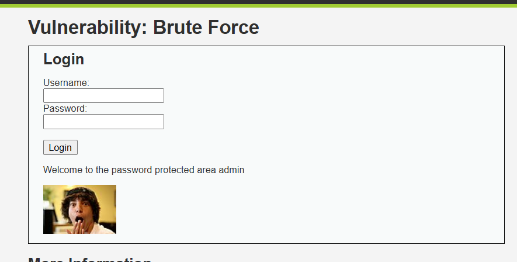
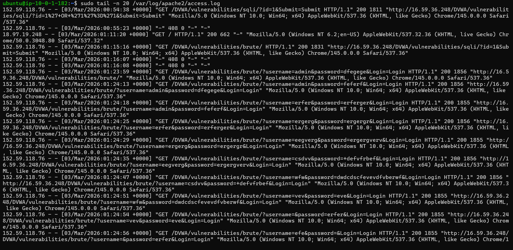
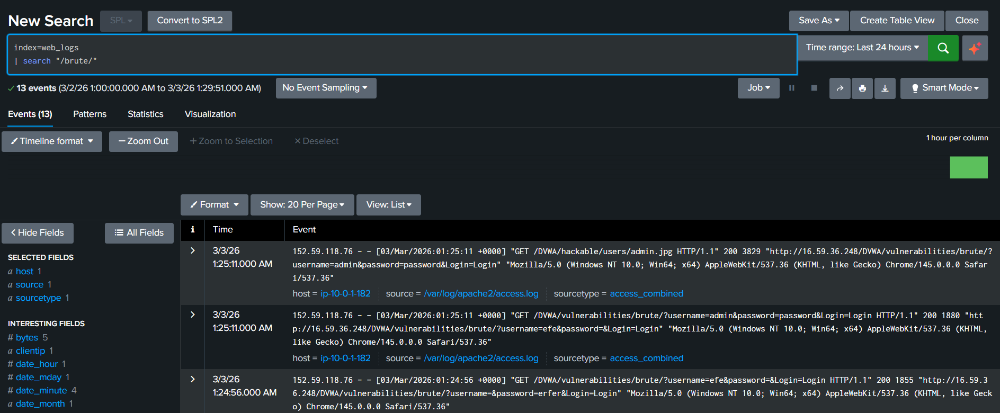
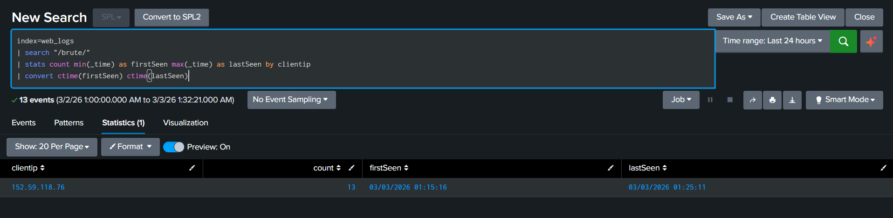

# WEB-02 — Brute Force Attack Detection via DVWA

   

---

## 📋 Executive Summary

A Brute Force attack was simulated against the DVWA (Damn Vulnerable Web Application) login page hosted on an Ubuntu EC2 web server. Multiple username and password combinations were submitted manually to generate repeated login attempts. Apache access logs captured every login request with the credentials visible in the URL. Splunk detected the brute force pattern by identifying repeated GET requests to `/DVWA/vulnerabilities/brute/` from a single IP, confirmed the attacker identity, and revealed the attack timeline.

---

## 🧩 Lab Environment

| Component | Details |
|---|---|
| Attacker Machine | Analyst Laptop |
| Target Server | Ubuntu EC2 — Apache2 + DVWA |
| Target URL | `http://<public-ip>/DVWA/vulnerabilities/brute/` |
| SIEM | Splunk (`index = web_logs`) |
| Log Source | `/var/log/apache2/access.log` |
| DVWA Security Level | Low |

---

## 🧠 What is a Brute Force Attack?

An attacker tries many username and password combinations rapidly until the correct one is found.

**Example attempts:**
```
username=admin  password=123
username=admin  password=admin
username=admin  password=password
username=admin  password=admin123
```

In Apache logs, each attempt appears as a GET request with credentials visible in the URL.

---

## 🔴 Attack Simulation

### Step 1 — Open DVWA

Navigate to `http://<public-ip>/DVWA` → Login → Set DVWA Security to **Low** → Go to **Brute Force** module.

<p align="center">
  
</p>

---

### Step 2 — Enter Multiple Wrong Passwords

Manually submit these combinations one by one:

| Username | Password |
|---|---|
| admin | 123 |
| admin | 1234 |
| admin | admin |
| admin | wrongpass |
| admin | password |

Repeat several times. This generates the brute force traffic in Apache logs.

---

## 📄 Attack Confirmation in Apache Logs

Run on the Ubuntu server:

```bash
sudo tail -n 20 /var/log/apache2/access.log
```

You will see repeated GET requests like:

```
GET /DVWA/vulnerabilities/brute/?username=admin&password=wrongpass&Login=Login HTTP/1.1" 200
GET /DVWA/vulnerabilities/brute/?username=admin&password=admin&Login=Login HTTP/1.1" 200
GET /DVWA/vulnerabilities/brute/?username=admin&password=1234&Login=Login HTTP/1.1" 200
```

Many repeated login attempts from the same IP → **Attack confirmed in logs.**

<p align="center">
  
</p>

---

## 🔍 Splunk Detection

Go to **Splunk → Search & Reporting** and run the queries below.

---

### Query 1 — Confirm Brute Force Requests

```spl
index=web_logs
| search "/brute/"
```

If results appear → Brute Force traffic detected in Splunk.

<p align="center">
  
</p>

---

### Query 2 — Identify Attacker IP

```spl
index=web_logs
| search "/brute/"
| stats count by clientip
| sort -count
```

**Result:**

| clientip | count |
|---|---|
| 152.59.118.76 | 13 |

→ Attacker IP: **`152.59.118.76`**

<p align="center">
  
</p>

---

### Query 3 — Check Login Success or Failure

```spl
index=web_logs
| search "/brute/"
| stats count by status
```

**HTTP Status Code meanings:**

| Status | What It Means |
|---|---|
| `200` | Login page returned — attempt failed, wrong password |
| `302` | Redirect — **possible successful login** |
| `401` | Unauthorized |

→ If you see `302` in results → login may have succeeded. Investigate further.

---

### Query 4 — Attack Timeline

```spl
index=web_logs
| search "/brute/"
| stats count min(_time) as firstSeen max(_time) as lastSeen by clientip
| convert ctime(firstSeen) ctime(lastSeen)
```

**From the lab results:**

| clientip | count | firstSeen | lastSeen |
|---|---|---|---|
| 152.59.118.76 | 13 | 03/03/2026 01:15:10 | 03/03/2026 01:25:11 |

→ 13 attempts within ~10 minutes — consistent with **automated or manual brute force.**

> 📸 **Screenshot here → save as** `assets/WEB-02-05-attack-timeline.png`
>
> *(Should show: Splunk timeline table with count, firstSeen, lastSeen per clientip)*

```

```

---

### Query 5 — Inspect Raw Payloads

```spl
index=web_logs
| search "/brute/"
| table _time clientip uri status
```

Inside the `uri` column you will see credentials in plaintext:

```
/DVWA/vulnerabilities/brute/?username=admin&password=wrongpass&Login=Login
/DVWA/vulnerabilities/brute/?username=admin&password=admin&Login=Login
```

→ This confirms brute force login attempts with different passwords.

---

## 🧠 SOC Investigation Summary

### Investigation Findings

| Question | Answer |
|---|---|
| Who is the attacker? | `152.59.118.76` (External IP) |
| What was targeted? | `/DVWA/vulnerabilities/brute/` |
| How many attempts? | 13 requests |
| Attack duration? | ~10 minutes |
| Was login successful? | Check for HTTP `302` redirect |
| Was it automated? | Likely — rapid sequential requests |
| Is IP internal or external? | External |

---

### ⚠️ Risk Assessment

| Field | Value |
|---|---|
| **Severity** | 🔴 HIGH |
| **Attack Type** | Brute Force Login |
| **Credentials Exposed** | Username + passwords visible in URL |
| **Attacker** | External IP — `152.59.118.76` |

---

## 🛡️ MITRE ATT&CK Mapping

| Tactic | Technique | ID |
|---|---|---|
| Credential Access | Brute Force | T1110 |
| Initial Access | Valid Accounts (if successful) | T1078 |

---

## ✅ Recommended Actions

| Priority | Action |
|---|---|
| 🔴 Immediate | Block IP `152.59.118.76` at firewall / WAF |
| 🔴 Immediate | Check for HTTP 302 responses — confirm if login succeeded |
| 🟠 Short-term | Enable **account lockout** after 5 failed attempts |
| 🟠 Short-term | Enable **CAPTCHA** on login forms |
| 🟠 Short-term | Enable **MFA** for all accounts |
| 🟡 Long-term | Set login **rate limiting** (max 10 requests/minute per IP) |
| 🟡 Long-term | Create Splunk alert for 5+ login attempts from same IP in 60 seconds |

---

## 🎯 Conclusion

A Brute Force attack against the DVWA login page was successfully simulated and detected. Apache access logs captured every login attempt with credentials visible in the URL. Splunk identified the attacker IP `152.59.118.76`, confirmed 13 login attempts, and showed the attack timeline spanning ~10 minutes. No HTTP 302 redirect was observed, indicating the correct password was not guessed during this session.

**Detection pipeline worked end-to-end. ✅**

---

## 🏁 Lab Status

| Step | Status |
|---|---|
| Attack Simulated | ✅ |
| Logs Captured in Apache | ✅ |
| Logs Forwarded to Splunk | ✅ |
| Attacker IP Identified | ✅ |
| Login Success/Failure Checked | ✅ |
| Attack Timeline Analysed | ✅ |
| SOC Investigation Complete | ✅ |

---

## 🎓 Learning Outcomes

- How brute force attacks appear in Apache access logs
- How credentials are exposed in plain text in GET request URLs
- How to detect brute force patterns in Splunk using URI search
- How HTTP status codes reveal login success (`302`) vs failure (`200`)
- How to identify attacker IP and attack timeline from SIEM data

---
