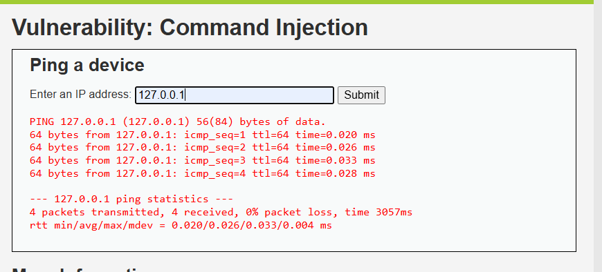
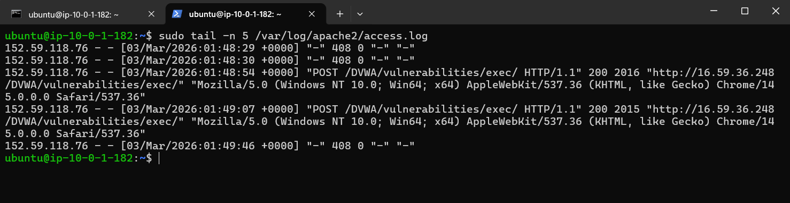
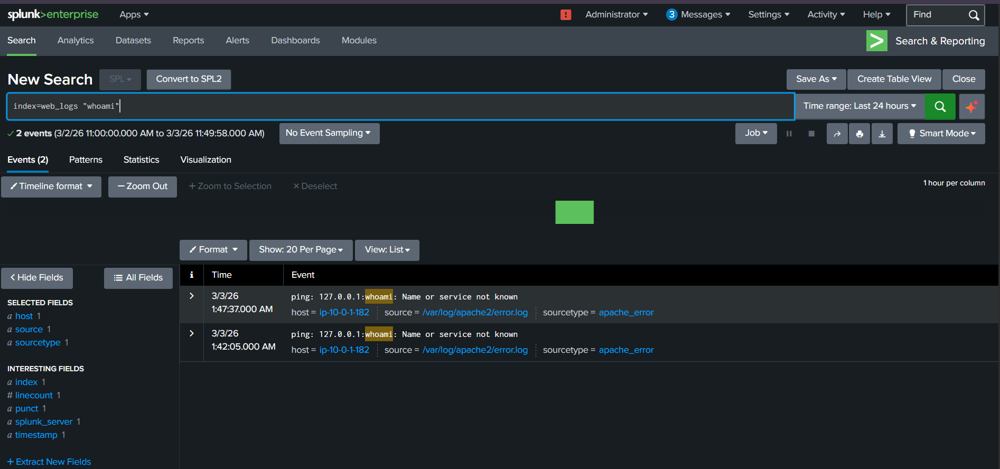
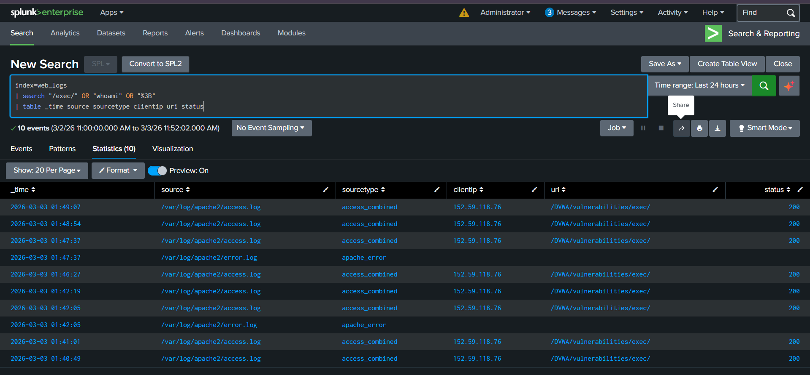

# WEB-03 — Command Injection Attack Detection via DVWA

   

---

## 📋 Executive Summary

A Command Injection (RCE) attack was simulated against the DVWA Command Injection module hosted on an Ubuntu EC2 web server. The payload `127.0.0.1;whoami` was injected into the IP address input field, causing the server to execute the `whoami` OS command and return `www-data` — confirming Remote Command Execution. Apache access logs captured the encoded payload (`%3B` = `;`), which was forwarded to Splunk. Splunk successfully detected the attack by searching for command injection signatures in the `/exec/` endpoint.

---

## 🧩 Lab Environment

| Component | Details |
|---|---|
| Attacker Machine | Analyst Laptop |
| Target Server | Ubuntu EC2 — Apache2 + DVWA |
| Target URL | `http://<public-ip>/DVWA/vulnerabilities/exec/` |
| SIEM | Splunk (`index = web_logs`) |
| Log Source | `/var/log/apache2/access.log` |
| DVWA Security Level | Low |

---

## 🧠 What is Command Injection?

The application passes user input directly into an OS command without sanitization. An attacker can append extra commands using the `;` separator.

**Vulnerable backend code (DVWA):**
```php
system("ping " . $_GET['ip']);
```

When attacker enters `127.0.0.1;whoami`, the server runs:
```bash
ping 127.0.0.1
whoami
```

The `;` separates the two commands — so `whoami` executes as a separate OS command on the server.

---

## 🔴 Attack Simulation

### Step 1 — Open DVWA

Navigate to `http://<public-ip>/DVWA` → Login → Set DVWA Security to **Low** → Go to **Command Injection** module.

You will see an input box:
```
Enter an IP address:
```

---

### Step 2 — Normal Test (Baseline)

Enter a normal IP to confirm the form works:

```
127.0.0.1
```

You will see standard ping output — this is normal behavior.

<p align="center">
  
</p>


---

### Step 3 — Perform Command Injection

Now enter the injection payload:

```
127.0.0.1;whoami
```

Click **Submit**.

**Expected output:**
```
www-data
```

This confirms the `whoami` OS command executed successfully on the server — **Remote Command Execution (RCE) confirmed.**


---

## 📄 Attack Confirmation in Apache Logs

Run on the Ubuntu EC2 server:

```bash
sudo tail -n 5 /var/log/apache2/access.log
```

You will see the payload encoded in the URL:

```
GET /DVWA/vulnerabilities/exec/?ip=127.0.0.1%3Bwhoami&Submit=Submit HTTP/1.1" 200
POST /DVWA/vulnerabilities/exec/ HTTP/1.1" 200
```

**URL Encoding Reference:**

| Encoded | Actual Character |
|---|---|
| `%3B` | `;` (semicolon / command separator) |

So `127.0.0.1%3Bwhoami` = `127.0.0.1;whoami` — the injection payload is visible in the log.

<p align="center">
  
</p>


---

## 🔍 Splunk Detection

Go to **Splunk → Search & Reporting** and run the queries below.

---

### Query 1 — Basic Detection (Find /exec/ Requests)

```spl
index=web_logs "/exec/"
```

Shows all requests hitting the Command Injection endpoint.

---

### Query 2 — Detect Encoded Command Separator

```spl
index=web_logs "%3B"
```

Finds requests containing `%3B` — the URL-encoded `;` used to chain OS commands.

---

### Query 3 — Detect Command Keywords

```spl
index=web_logs "whoami"
```

Directly searches for the `whoami` command in log data.

---

### Query 4 — Professional SOC Detection Query

```spl
index=web_logs
| search "/exec/" AND ("whoami" OR "%3B" OR "id")
| table _time source sourcetype clientip uri status
```

<p align="center">
  
</p>


---

### Query 5 — Identify Attacker IP

```spl
index=web_logs "/exec/"
| stats count by clientip
```

**Result:** Attacker IP → **`152.59.118.76`**

---

### Query 6 — Attack Timeline

```spl
index=web_logs "/exec/"
| stats min(_time) as firstSeen max(_time) as lastSeen by clientip
| convert ctime(firstSeen) ctime(lastSeen)
```

<p align="center">
  
</p>

→ Shows when the attack started and ended.

---

### Query 7 — Check HTTP Status Codes

```spl
index=web_logs "/exec/"
| stats count by status
```

| Status | What It Means |
|---|---|
| `200` | Command executed — server returned output |
| `500` | Server error during execution |

→ HTTP 200 confirms the server processed the injection and returned output.

---

## 🧠 SOC Investigation Summary

### Investigation Findings

| Question | Answer |
|---|---|
| Who is the attacker? | `152.59.118.76` (External IP) |
| What was targeted? | `/DVWA/vulnerabilities/exec/` |
| What payload was used? | `127.0.0.1;whoami` |
| Was attack successful? | ✅ Yes — server returned `www-data` |
| What command ran? | `whoami` — OS command executed as `www-data` |
| How did it appear in logs? | `127.0.0.1%3Bwhoami` (`;` encoded as `%3B`) |
| HTTP Status? | 200 — request fully processed |

---

### ⚠️ Risk Assessment

| Field | Value |
|---|---|
| **Severity** | 🔴 HIGH (RCE) |
| **Impact** | OS command executed on web server |
| **Execution User** | `www-data` (Apache process user) |
| **Attacker** | External IP — `152.59.118.76` |

---

## 🛡️ MITRE ATT&CK Mapping

| Tactic | Technique | ID |
|---|---|---|
| Execution | Command and Scripting Interpreter | T1059 |
| Initial Access | Exploit Public-Facing Application | T1190 |

---

## ✅ Recommended Actions

| Priority | Action |
|---|---|
| 🔴 Immediate | Block IP `152.59.118.76` at firewall / WAF |
| 🔴 Immediate | Take vulnerable endpoint offline — confirmed RCE |
| 🟠 Short-term | Implement **input validation** — only allow IP address format |
| 🟠 Short-term | Escape special characters `;`, `&`, `\|` in all user inputs |
| 🟠 Short-term | Disable dangerous PHP functions (`system`, `exec`, `shell_exec`) |
| 🟡 Long-term | Deploy WAF with rules blocking `;`, `%3B`, `whoami`, `id` in URLs |
| 🟡 Long-term | Create Splunk alert for `%3B` or `whoami` in `index=web_logs` |

---

## 🎯 Conclusion

A Command Injection (RCE) attack against DVWA was successfully simulated and detected. The payload `127.0.0.1;whoami` caused the server to execute an OS command and return `www-data`. Apache logs captured the encoded payload `%3B` and Splunk detected the attack via the `/exec/` endpoint. This is one of the most critical web vulnerabilities — a real attacker could escalate from `whoami` to reading files, dropping shells, or full server takeover.

**Detection pipeline worked end-to-end. ✅**

---

## 🏁 Lab Status

| Step | Status |
|---|---|
| Attack Simulated | ✅ |
| RCE Confirmed (`www-data` returned) | ✅ |
| Logs Captured in Apache | ✅ |
| Logs Forwarded to Splunk | ✅ |
| Attacker IP Identified | ✅ |
| SOC Investigation Complete | ✅ |

---

## 🎓 Learning Outcomes

- How Command Injection exploits unsanitized OS function calls
- How `;` acts as a command separator in Linux
- How encoded payloads look in Apache logs (`%3B` = `;`)
- How Splunk detects command injection using URI keyword searches
- Why HTTP 200 on an `/exec/` endpoint with encoded characters is a critical alert
- MITRE ATT&CK mapping for RCE attacks (T1059)

---
