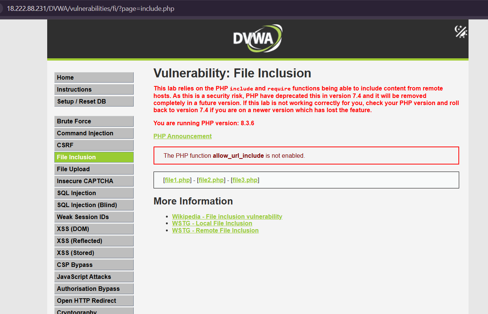
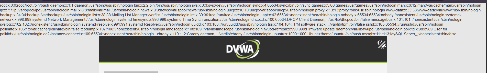
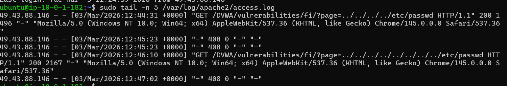
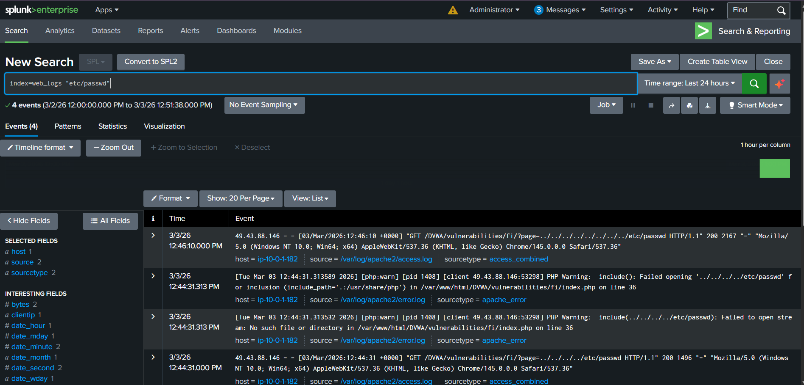
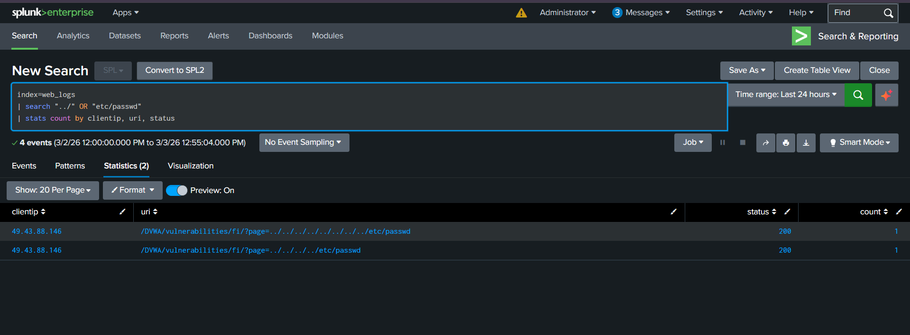

# WEB-04 — Local File Inclusion (LFI) Attack Detection via DVWA

   

---

## 📋 Executive Summary

A Local File Inclusion (LFI) attack was simulated against the DVWA File Inclusion module hosted on an Ubuntu EC2 web server. The attacker manipulated the `page` parameter using a directory traversal payload `../../../../etc/passwd` to force the server to include and display the Linux system file `/etc/passwd`. The server responded with all system user entries confirming sensitive file exposure. Apache logs captured the traversal payload in the GET request, and Splunk detected the attack by identifying `../` patterns and `etc/passwd` in the URI.

---

## 🧩 Lab Environment

| Component | Details |
|---|---|
| Attacker Machine | Analyst Laptop |
| Target Server | Ubuntu EC2 — Apache2 + DVWA |
| Target URL | `http://<public-ip>/DVWA/vulnerabilities/fi/?page=` |
| SIEM | Splunk (`index = web_logs`) |
| Log Source | `/var/log/apache2/access.log` |
| DVWA Security Level | Low |

---

## 🧠 What is LFI?

Local File Inclusion happens when a web application passes user input directly into a file include function without validation.

**Vulnerable PHP code (DVWA backend):**
```php
include($_GET['page']);
```

If an attacker controls the `page` parameter, they can use `../` (directory traversal) to navigate outside the web directory and load any file on the server — including sensitive system files like `/etc/passwd`.

**Why `../../../../`?**

Each `../` goes one directory up:

```
/var/www/html/DVWA/vulnerabilities/fi/  ← starting point
../  →  /var/www/html/DVWA/vulnerabilities/
../  →  /var/www/html/DVWA/
../  →  /var/www/html/
../  →  /var/www/
then: /etc/passwd  →  full path reached
```

---

## 🔴 Attack Simulation

### Step 1 — Open DVWA File Inclusion Module

Navigate to `http://<public-ip>/DVWA` → Login → Set DVWA Security to **Low** → Go to **File Inclusion** module.

You will see a URL like:
```
http://<your-ip>/DVWA/vulnerabilities/fi/?page=include.php
```

<p align="center">
  
</p>


---

### Step 2 — Perform LFI Attack

Replace `include.php` in the URL with the traversal payload:

```
?page=../../../../etc/passwd
```

Full URL:
```
http://<your-ip>/DVWA/vulnerabilities/fi/?page=../../../../etc/passwd
```

Press **Enter**.

---

### Step 3 — View Attack Result

If vulnerable, the page will display the contents of `/etc/passwd`:

```
root:x:0:0:root:/root:/bin/bash
daemon:x:1:1:daemon:/usr/sbin:/usr/sbin/nologin
www-data:x:33:33:www-data:/var/www:/usr/sbin/nologin
...
```

→ **LFI confirmed. Sensitive system file exposed.**

<p align="center">
  
</p>


---

## 📄 Attack Confirmation in Apache Logs

Run on the Ubuntu EC2 server:

```bash
sudo tail -n 5 /var/log/apache2/access.log
```

You will see the traversal payload in the log:

```
GET /DVWA/vulnerabilities/fi/?page=../../../../etc/passwd HTTP/1.1" 200
GET /DVWA/vulnerabilities/fi/?page=../../../../../../../etc/passwd HTTP/1.1" 200 2167
```

The `../../../../etc/passwd` path is clearly visible — **attack evidence confirmed in Apache logs.**

<p align="center">
  
</p>


---

## 🔍 Splunk Detection

Go to **Splunk → Search & Reporting** and run the queries below.

---

### Query 1 — Basic Detection (Search for /etc/passwd)

```spl
index=web_logs "etc/passwd"
```

Finds any request that attempted to access the passwd file.

---

### Query 2 — Detect Directory Traversal Pattern

```spl
index=web_logs "../"
| stats count by clientip, uri, status
```

<p align="center">
  
</p>

---

### Query 3 — Professional SOC Detection Query

```spl
index=web_logs
| search "../" OR "etc/passwd"
| stats count by clientip, uri, status
```

**Result from lab:**

| clientip | uri | status | count |
|---|---|---|---|
| 49.43.88.146 | `/DVWA/vulnerabilities/fi/?page=../../../../etc/passwd` | 200 | 1 |
| 49.43.88.146 | `/DVWA/vulnerabilities/fi/?page=../../../../../../../etc/passwd` | 200 | 1 |

<p align="center">
  
</p>

---

### Query 4 — Timeline Analysis

```spl
index=web_logs "../"
| stats min(_time) as firstSeen max(_time) as lastSeen by clientip
| convert ctime(firstSeen) ctime(lastSeen)
```

→ Shows when the attack started and ended.

---

### Query 5 — Check HTTP Status Codes

```spl
index=web_logs "../"
| stats count by status
```

| Status | What It Means |
|---|---|
| `200` | File included and served — attack successful |
| `404` | File not found — traversal failed |
| `500` | Server error during inclusion |

→ HTTP 200 confirms the server successfully returned the file contents.

---

## 🧠 SOC Investigation Summary

### Investigation Findings

| Question | Answer |
|---|---|
| Who is the attacker? | `49.43.88.146` (External IP) |
| What was targeted? | `/DVWA/vulnerabilities/fi/` |
| What payload was used? | `../../../../etc/passwd` |
| Was attack successful? | ✅ Yes — `/etc/passwd` contents returned |
| What was exposed? | System user list including `root`, `www-data` |
| HTTP Status? | 200 — file fully served |
| Apache error log? | PHP Warning — `include()` failed (deeper traversal) |

---

### ⚠️ Risk Assessment

| Field | Value |
|---|---|
| **Severity** | 🔴 HIGH |
| **Attack Type** | Local File Inclusion / Path Traversal |
| **Impact** | Sensitive system file (`/etc/passwd`) exposed |
| **Attacker** | External IP — `49.43.88.146` |

---

## 🛡️ MITRE ATT&CK Mapping

| Tactic | Technique | ID |
|---|---|---|
| Discovery | File and Directory Discovery | T1083 |
| Initial Access | Exploit Public-Facing Application | T1190 |
| Collection | Data from Local System | T1005 |

---

## ✅ Recommended Actions

| Priority | Action |
|---|---|
| 🔴 Immediate | Block IP `49.43.88.146` at firewall / WAF |
| 🔴 Immediate | Audit what other files may have been accessed |
| 🟠 Short-term | Implement **allowlist** — only permit specific known filenames in the `page` parameter |
| 🟠 Short-term | Validate and sanitize all user input — reject `../` patterns |
| 🟠 Short-term | Disable PHP `allow_url_include` in `php.ini` |
| 🟡 Long-term | Deploy WAF rule blocking `../` and `/etc/` in query parameters |
| 🟡 Long-term | Create Splunk alert for `../` patterns in `index=web_logs` |

---

## 🎯 Conclusion

A Local File Inclusion attack against DVWA was successfully simulated and detected. The payload `../../../../etc/passwd` traversed the server directory structure and exposed the Linux system user file. Apache logs confirmed the traversal path in the GET request, and Splunk detected the attack using URI pattern searches. The HTTP 200 response confirms the attack was fully successful — the server returned the file contents without any restriction.

**Detection pipeline worked end-to-end. ✅**

---

## 🏁 Lab Status

| Step | Status |
|---|---|
| Attack Simulated | ✅ |
| `/etc/passwd` Exposed | ✅ |
| Logs Captured in Apache | ✅ |
| Logs Forwarded to Splunk | ✅ |
| Attacker IP Identified | ✅ |
| SOC Investigation Complete | ✅ |

---

## 🎓 Learning Outcomes

- How LFI exploits unsanitized `include()` calls in PHP
- How `../` directory traversal navigates outside the web root
- How traversal payloads appear in Apache access logs
- How Splunk detects LFI by searching for `../` and `etc/passwd` in URIs
- Why HTTP 200 on a traversal request is a critical finding
- MITRE ATT&CK mapping for path traversal and file disclosure attacks

---
